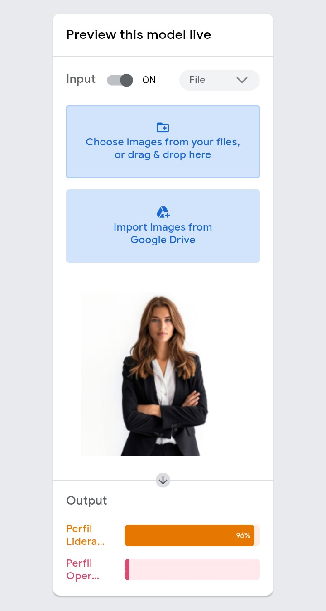
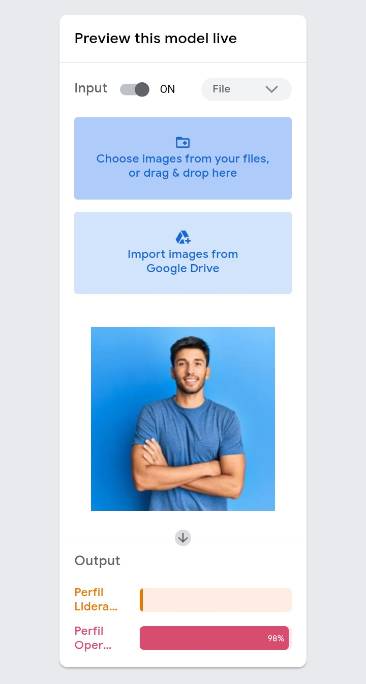

🧠 Classificador de Perfil (Viés Intencional)


📝 Descrição do Projeto

Este projeto é um laboratório de classificação visual desenvolvido com o Teachable Machine do Google. O objetivo é demonstrar, na prática, como vieses nos dados de treinamento podem levar a um modelo de inteligência artificial a cometer erros sistemáticos e injustos.

Foram criadas duas classes:

* **"Perfil Liderança" –** treinado exclusivamente com imagens de homens de terno.
* **"Perfil Operacional" –** treinado com imagens de mulheres ou pessoas com roupas informais.

Ao testar o modelo com uma pessoa que não se encaixa nesses estereótipos (ex: homem com camiseta, mulher de terno, etc.), o classificador produz erros de inferência (falsos positivos/negativos), comprovando o viés embutido.

* **Exemplo 1**


* **Exemplo 2**


⚠️ Propósito educacional: demonstrar a importância de datasets diversos e representativos para evitar discriminação algorítmica.

---

🚀 Tecnologias Utilizadas

* **Teachable Machine (Google) –** treinamento e exportação do modelo
* **TensorFlow.js –** execução do modelo diretamente no navegador
* **JavaScript (ES6) –** lógica de captura de câmera e inferência
* **HTML5 / CSS3 –** interface simples para demonstração

---

📊 Funcionalidades e Diferenciais

* Classificação em tempo real via webcam.
* Detecção de viés – o modelo é propositalmente enviesado para fins didáticos.
* Exibição da confiança da predição para cada classe.
* Experimento controlado – permite ao usuário testar diferentes perfis e observar erros.
* Código simples e educativo – fácil de modificar e entender a lógica por trás do viés.

---

🧪 Como Executar (Teste do Viés)

1. Clone o repositório ou baixe os arquivos (model.json, metadata.json, weights.bin e um arquivo HTML/JS para inferência – veja exemplo abaixo).
2. Sirva os arquivos localmente (por exemplo, com npx http-server ou usando a extensão Live Server do VS Code).
3. Abra o arquivo HTML no navegador.
4. Permita o acesso à câmera quando solicitado.
5. Aponte a câmera para diferentes pessoas/objetos e observe como o modelo classifica.

📸 Registro do erro: Tire um print quando o modelo classificar incorretamente alguém que não se encaixa nos estereótipos de treinamento.

---

🔧 Exemplo de Código para Inferência (HTML + JS)

```html
<!DOCTYPE html>
<html>
<head>
  <title>Classificador de Perfil (Viés)</title>
  <script src="https://cdn.jsdelivr.net/npm/@tensorflow/tfjs@1.3.1/dist/tf.min.js"></script>
  <script src="https://cdn.jsdelivr.net/npm/@teachablemachine/image@0.8/dist/teachablemachine-image.min.js"></script>
</head>
<body>
  <video id="webcam" width="400" height="400" autoplay muted></video>
  <div id="resultado"></div>
  <script>
    const modelURL = "model.json";
    const metadataURL = "metadata.json";

    let model, webcam, maxPredictions;

    async function init() {
      const modelInfo = await fetch(modelURL);
      model = await tmImage.load(modelURL, metadataURL);
      maxPredictions = model.getTotalClasses();

      webcam = new tmImage.Webcam(400, 400);
      await webcam.setup();
      await webcam.play();
      document.getElementById("webcam").srcObject = webcam.webcam.stream;

      window.requestAnimationFrame(loop);
    }

    async function loop() {
      webcam.update();
      const predictions = await model.predict(webcam.canvas);
      let result = "";
      for (let i = 0; i < maxPredictions; i++) {
        result += `${predictions[i].className}: ${(predictions[i].probability * 100).toFixed(1)}%<br>`;
      }
      document.getElementById("resultado").innerHTML = result;
      window.requestAnimationFrame(loop);
    }

    init();
  </script>
</body>
</html>
```

---

📚 Contexto Educacional

Este experimento é frequentemente utilizado em cursos de Ética em IA, Machine Learning e Design de Sistemas para ilustrar:

· Como a escolha dos dados de treinamento impacta diretamente o comportamento do modelo.
· A importância de datasets balanceados e diversos.
· O risco de reforço de estereótipos sociais por sistemas automatizados.

---

[Voltar ao início]
(https://github.com/unsVolts/portfolio-gustavo-oliveira-castro)
